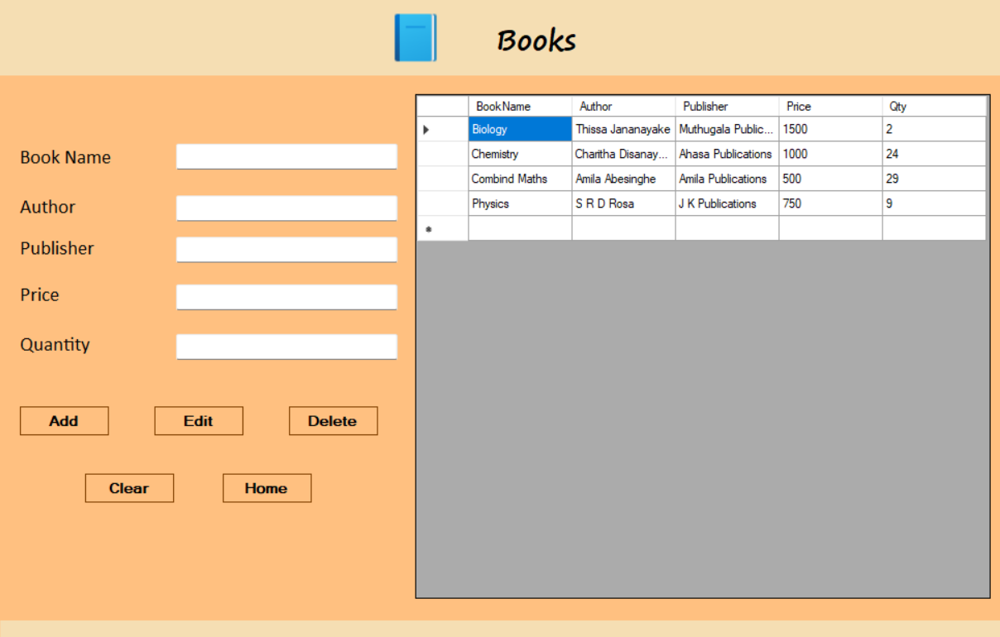
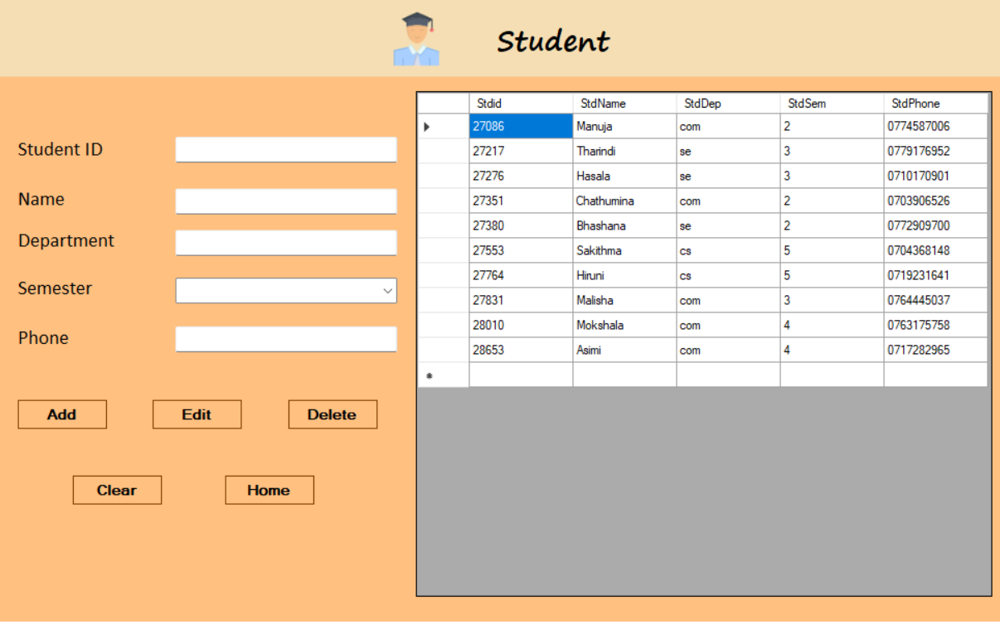
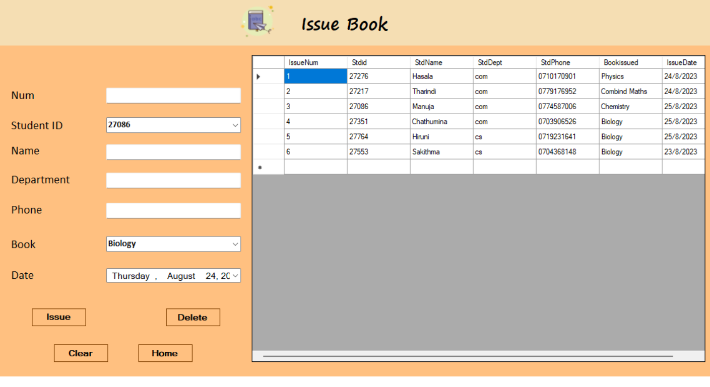
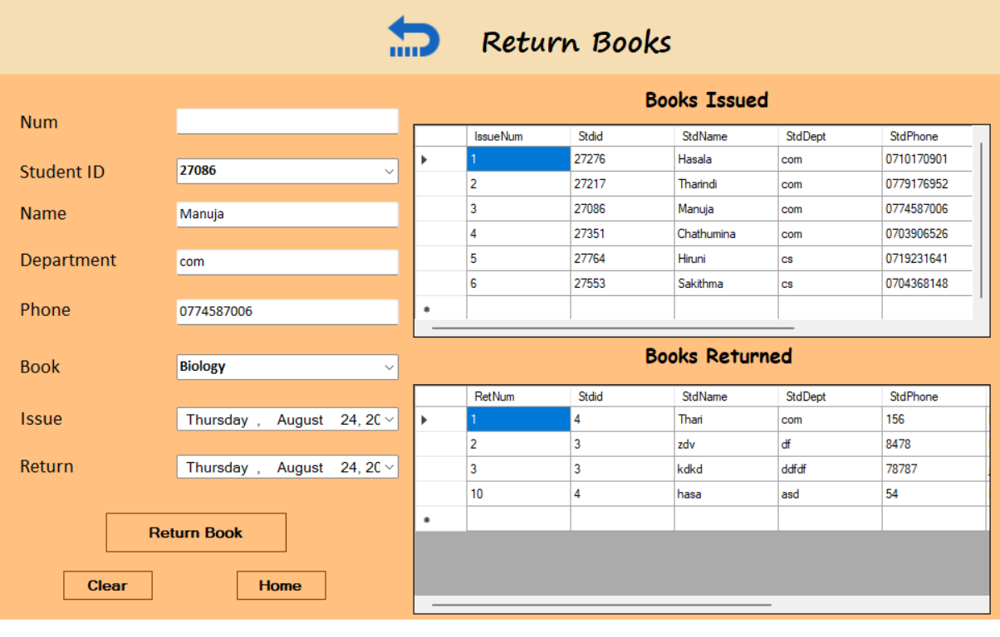
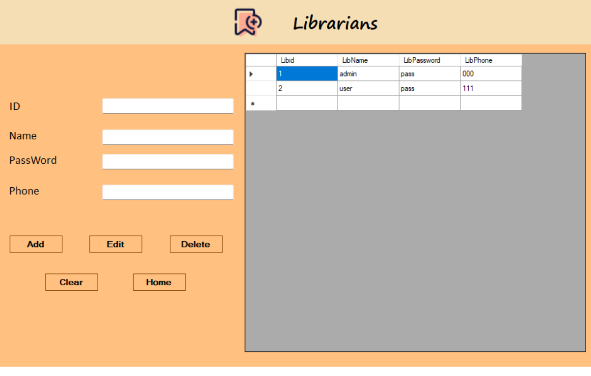

# 📚 Library Management System

A Windows Forms-based Library Management System created using **C#** and **SQL Server**, designed to manage books, students, librarians, book issues, and returns efficiently.

---

## 🚀 Features

- ✅ **Librarian Login Authentication**
- ✅ **Dashboard with Navigation**
- ✅ **Add/Edit/Delete Books**
- ✅ **Add/Edit/Delete Students**
- ✅ **Issue & Return Books**
- ✅ **Track Book Availability**
- ✅ **Add/Edit/Delete Librarians**
- ✅ **Loading screen with animation**
- ✅ **About Us page**

---

## 🖼️ Screenshots

### ✅ Loading Page
.png)

### ✅ Login Page

> Login using:
> - Username: `admin`
> - Password: `pass`

### ✅ Dashboard


### ✅ Books Management


### ✅ Student Management


### ✅ Issue Books


### ✅ Return Books


### ✅ Librarian Management


---

## 🏗️ Tech Stack

- **Language:** C#
- **Framework:** .NET Windows Forms
- **Database:** SQL Server (MSSQLLocalDB)
- **UI Tools:** Visual Studio Designer

---

## 🛠️ How to Run

1. Clone the repository:
   ```bash
   git clone https://github.com/hasalaperera/Library-Management-System.git
   ```

2. Open the solution file (`.sln`) in **Visual Studio**.

3. Ensure your local SQL database is correctly configured:
   - Update the `SqlConnection` string if necessary.

4. Build and Run the project:
   - Press `F5` or click **Start**.

---

## 📌 Notes

- Only users listed in the **Librarian table** can log in.
- Data in dropdowns auto-fill from existing database values.
- Book quantity is dynamically tracked in the issue system.

---

## 📄 License

This project is created for academic purposes and is not licensed for commercial use.

---